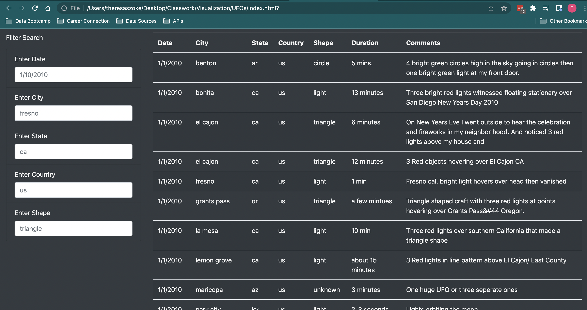
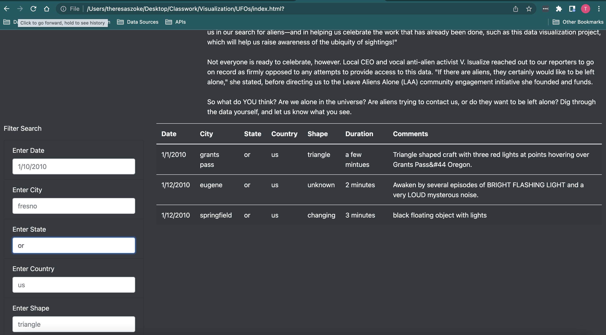
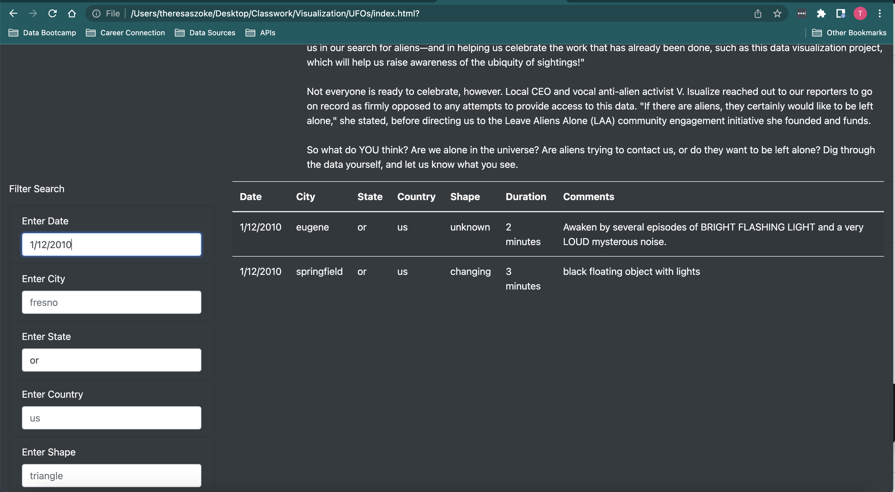

# UFOs - *The Truth Is Out There*

## Overview of Project

In this project, we have used JavaScript, HTML, Bootstrap and CSS to help Dana, a data journalist, to create and present an interactive dynamic webpage full of content about UFOs and UFO sightings, which will accompany her online article about UFO sightings in McMinnville, Oregon. The webpage displays a table of UFO observations reported by ufologists. A set of filters has been added to the webpage to allow a user to interact with and filter the observation results to specific dates, cities, states, coutries or observed shapes.  

## Results

When a user opens the delivered webpage, all data is displayed along with the form which allows the user to enter values to filter the data:

As soon as a user interacts with the form, for example by entering the value "or" for the selected State, the results are filtered to only those records from Oregon, as shown below:

The user can add additional filters to further refine the results, as shown below by adding a date to the selected State filter:

The user can reset the page by refreshing it, or by deleting the selected values previously entered for any filter.

## Summary

While this design has met Dana's stated objective of presenting the table of UFO sighting data, and allowing users to interact and filter the results, there are opportunities to futher refine it.

### Drawbacks

There are some drawbacks to the current design. From my perspective, the biggest challenge of using the filter form effectively was that I had no idea what values are in the data set to select from.  For example, I wasn't sure what countries have reported observations.  I tried entering 'mx' to see if there were observations from Mexico, but this returned no results.  I tried entering 'ca' for Canada, and indeed found two results.  But I do not know if any other countries have data.  It would be preferable if the form showed the user the values from which to pick for the filter.

### Recommendations

Using a table to display the UFO observations is one tried and true method of sharing information.  This type of visualization can be improved by:
1. Updating the form to allow users to pick values from the dataset to create the filter criteria
2. Allowing users to sort the data in the displayed columns

However there are other more impactful ways that this data could have been displayed.  For example, instead of using the form to filter the table of observations, the data could have been displayed on a heat map.  This would literally show the user, on a map, where observations have been reported. The number of observations could be displayed by putting more points or increasing the size of the point based on the number of observations.  Perhaps the map could even be updated to show observations by date with a time bar selector.  The user could interact with the map to make filter selections and from there the table of data could be updated to show the selected observations along with the comments.  This type of visualization would address my initial issue with not knowing what countries or cities had any reported observations that I might have wanted to explore.
